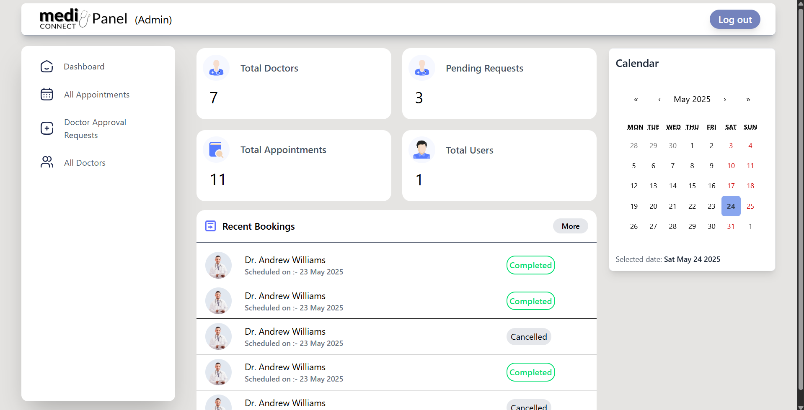
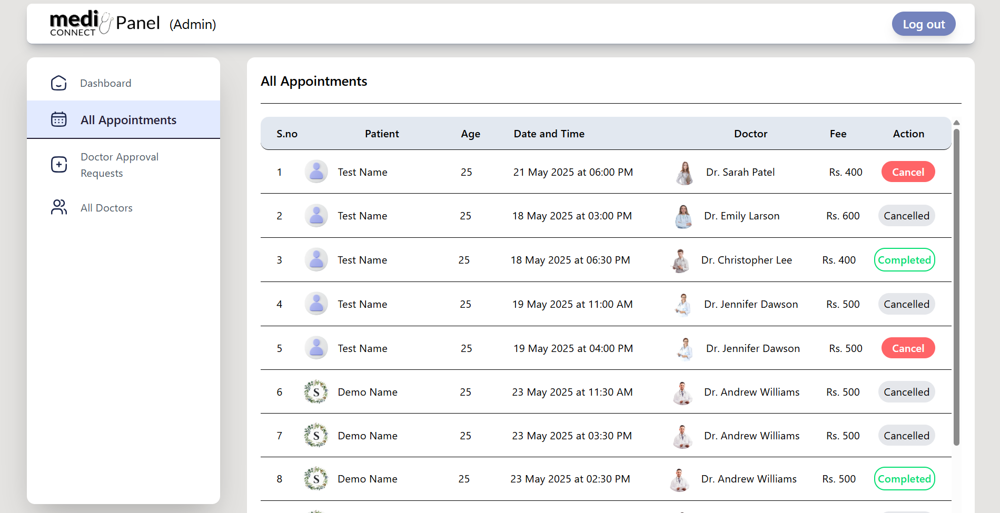
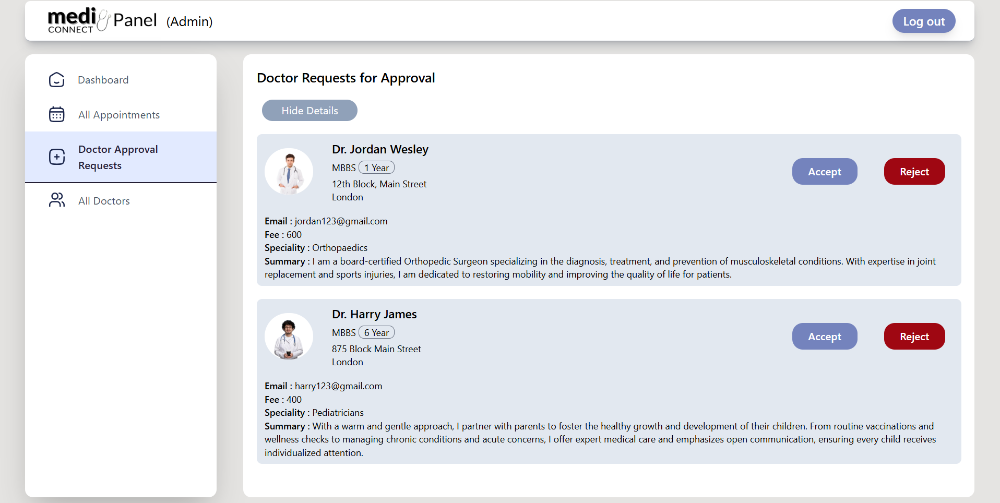
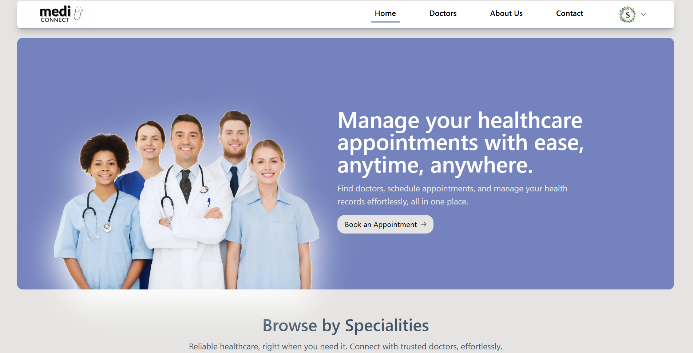
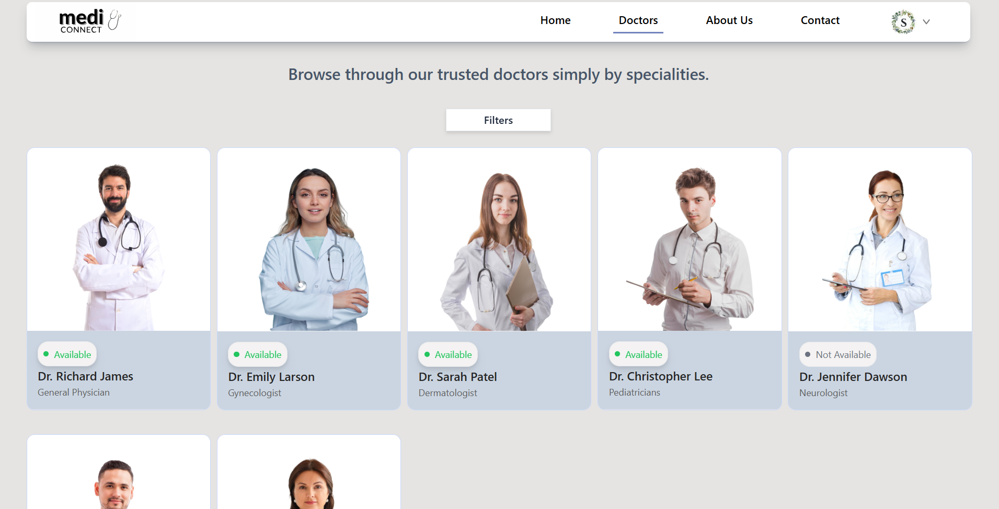
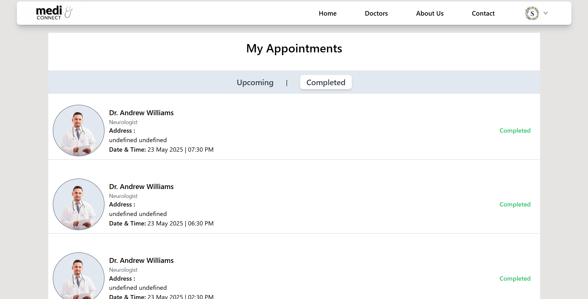
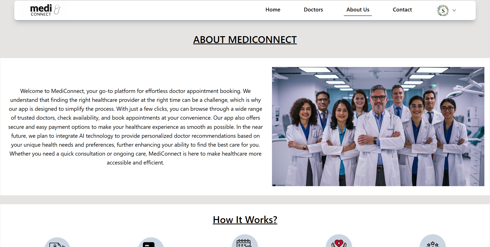
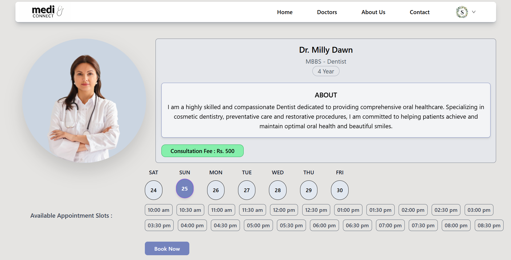

# MediConnect - An Online Doctor Appointment Booking Web App

Well we all know nowadays to get an appointment from a doctor can be a really tideous task. So here is my small effort to make this process easier at both the ends i.e., For the patients and the doctors. MediConnect is a full stack web application which helps the users to book appointments with doctors by simply clicking some buttons. This project has three phases, the first one is for the user's side, the second for the doctor's side and the last one for the Admin's side.

## Tech Stack

**Client:** React.js , TailwindCSS

**Server:** Node.js , Express.js

**Database:** MongoDB

**Database:** JSON Web Token(JWT)

## 🔑Features of MediConnect

Following are the key features of this fullstack web application :

### HOME PAGE

- Simple and responsive UI
- Easy to navigate to different pages
- Browse by speciality Section

### DOCTORS PAGE

- Lists all doctors available on the database
- Filter functionality available for the user to search efficiently
- User-Friendly Layout

### ABOUT US PAGE

- Displays how the application works
- Points out the Key Features and Benefits of this application

### CONTACT US PAGE

- Currently a dummy page
- Gives the basic idea of how the page should look like

### USER PROFILE PAGE

- Displays user information and enables the user to update their details

### SCHEDULED APPOINTMENTS PAGE

- Displays the list of appointments booked by the user
- Shows the Upcoming and Completed Appointments on different sections
- Gives user the option to pay online or cancel the upcoming appointment

## Some ScreenShots

### Admin Panel

### User Side

